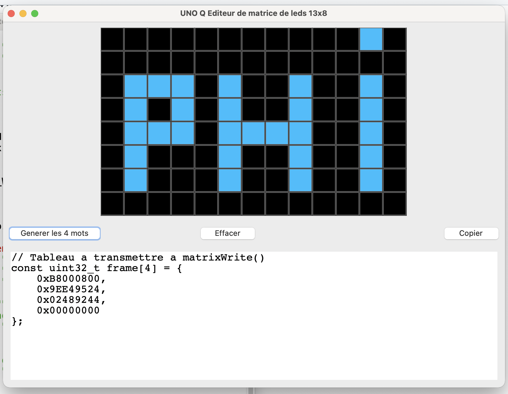

# UNO Q – Éditeur de matrice de LEDs 13x8 (Python + Tkinter)

Ce dépôt contient un petit outil graphique écrit en Python (Tkinter)  
permettant de **dessiner des motifs sur une matrice 13x8**   
et de générer automatiquement les **4 mots de 32 bits** à transmettre à la fonction :

```c
extern "C" void matrixWrite(const uint32_t *buf);
```
sur l’Arduino UNO Q (cœur STM32).

# Fonctionnalités :

- Affichage d’une grille **13 colonnes × 8 lignes** représentant la matrice de LEDs de la UNO Q.
- Clic sur une “LED” pour l’allumer / l’éteindre (LEDs bleues lorsqu’elles sont actives).
- Bouton « **Générer les 4 mots** » :
  - calcule les 4 uint32_t correspondant à l’état de la matrice,
  - affiche un bloc de code C prêt à coller dans un sketch Arduino.
- Bouton « **Effacer** » : remet toutes les LEDs à 0.
- Bouton « **Copier** » : copie le bloc C généré dans le presse-papiers.

  ---
  
# Prérequis :
- Python 3 installé (3.8 ou plus, par exemple).
- Tkinter installé (inclus par défaut avec Python sur la plupart des systèmes) :
  - macOS : fourni avec Python officiel,
  - Windows : fourni avec l’installateur Python standard,
  - Linux : parfois besoin d’installer **python3-tk** via le gestionnaire de paquets.

# Lancer l’éditeur :

Dans un terminal, à la racine du projet :

```bash
python3 matrix.py
```

ou sous Windows :
```bash
python matrix.py
```

Une fenêtre s’ouvre avec :
- en haut : la grille 13x8,
- au milieu : les boutons « Générer les 4 mots », « Effacer », « Copier »,
- en bas : la zone texte avec le code C généré.
## Utilisation
1. Cliquer sur les cases de la grille pour allumer / éteindre des LEDs.
2. Cliquer sur « Générer les 4 mots ».
3. Le bas de la fenêtre affiche un bloc C de la forme :

```c
// Tableau a transmettre a matrixWrite()
const uint32_t frame[4] = {
    0xB8000800,
    0x9EE49524,
    0x02489244,
    0x00000000
};
```
4. Cliquer sur « Copier » pour copier ce code dans le presse-papiers.
5. Coller ce bloc dans votre sketch UNO Q.

---

# Intégration dans un sketch C++ pour UNO Q :
Un exemple minimal :
```c
extern "C" void matrixWrite(const uint32_t *buf);
extern "C" void matrixBegin();

const uint32_t frame[4] = {
    0xB8000800,
    0x9EE49524,
    0x02489244,
    0x00000000
};

void setup() {
    matrixBegin();
    matrixWrite(frame);  // affiche le motif sur la matrice
}

void loop() {
    // rien à faire ici pour un motif statique
}

```

Pour une animation, on peut déclarer plusieurs frames et un tableau de pointeurs :

```c
extern "C" void matrixWrite(const uint32_t *buf);
extern "C" void matrixBegin();

const uint32_t Heart1[4] = {
    0x108883b8,
    0x20820210,
    0x280220,
    0x2
};
const uint32_t Heart2[4] = {
  0x1988c7fc,
    0x60c60330,
    0x6c0630,
    0x7
 };
const uint32_t Heart3[4] = {
  0x1f88effe,
    0xe0ee03f0,
    0x80ee0e38,
    0xf
};

const uint32_t* HeartAnim[] = {
    Heart1,
    Heart2,
    Heart3
};

void playAnimation(const uint32_t* frames[], int frameCount, int repeat, int frameDelay) {
    for (int r = 0; r < repeat; r++) {
        for (int i = 0; i < frameCount; i++) {
            matrixWrite(frames[i]);
            delay(frameDelay);
        }
    }
}

void setup() {
  matrixBegin();
}

void loop() {
  playAnimation(HeartAnim, 3, 1, 1000);
}
```
Grâce à cet éditeur, chaque frame de l’animation peut être dessinée visuellement puis exportée en uint32_t[4].

---

# Principe de l’encodage (résumé) :

- La matrice comporte 13 colonnes × 8 lignes = 104 LEDs.
- Les LEDs sont numérotées ligne par ligne :

```text
index = y * 13 + x   // x = 0 à 12, y = 0 à 7
```
Chaque LED correspond à un bit dans un des 4 mots de 32 bits :

```text
mot = index // 32    // 0 à 3
bit = index % 32     // 0 à 31
```

- Si la LED est allumée, on met à 1 le bit correspondant :

```c
out[mot] |= (1u << bit);
```


L’éditeur Python automatise ce calcul et affiche le résultat directement au format exigé par `matrixWrite()`.

---

# Capture d'écran :



---

# Résultat :


### Crédit
Outil développé par philippe86220,  
avec l’aide de ChatGPT (modèle GPT-5.1 Thinking).
