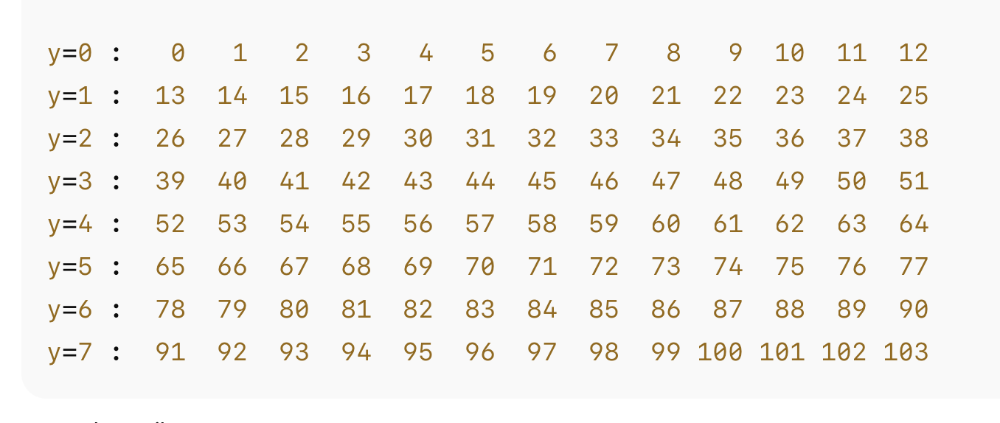

## 1. Constantes et état interne

```python
MATRIX_WIDTH = 13
MATRIX_HEIGHT = 8
CELL_SIZE = 40  # taille des carres en pixels
```

- `MATRIX_WIDTH` : nombre de colonnes (13).
- `MATRIX_HEIGHT` : nombre de lignes (8).
- `CELL_SIZE` : taille en pixels d’un “pixel LED” dans le Canvas (ici 40 × 40 px).

```python
self.led_state = [
    [False for _ in range(MATRIX_WIDTH)]
    for _ in range(MATRIX_HEIGHT)
]
```
- `led_state[y][x]` vaut :
  - `False` : LED éteinte
  - `True` : LED allumée
- C’est la représentation logique de la matrice.

---

2. Canvas et dessin de la grille
```python
   self.canvas = tk.Canvas(
    main_frame,
    width=MATRIX_WIDTH * CELL_SIZE,
    height=MATRIX_HEIGHT * CELL_SIZE,
    bg="gray20",
    highlightthickness=0
)
```

- Le `Canvas` est une surface de dessin de Tkinter.
- Sa taille est exactement 13 cases × 8 cases, chacune de `CELL_SIZE` pixels.

## 2.1 Tableau des rectangles
```python
self.rects = [
    [None for _ in range(MATRIX_WIDTH)]
    for _ in range(MATRIX_HEIGHT)
]
```
- `self.rects[y][x]` contiendra l’ID du rectangle dessiné dans le Canvas pour la LED `(x, y)`.
- Cela permet ensuite de changer facilement sa couleur.

## 2.2 Dessin de chaque “pixel LED”

```python
for y in range(MATRIX_HEIGHT):
    for x in range(MATRIX_WIDTH):
        x0 = x * CELL_SIZE
        y0 = y * CELL_SIZE
        x1 = x0 + CELL_SIZE - 2
        y1 = y0 + CELL_SIZE - 2
        rect = self.canvas.create_rectangle(
            x0, y0, x1, y1,
            fill="black",
            outline="dim gray"
        )
        self.rects[y][x] = rect
```
- La matrice est parcourue en lignes (`y`) puis colonnes (`x`).
- Chaque LED est représentée par un rectangle sur le Canvas.

**Coordonnées du rectangle**
Pour une LED en position (x, y) :
- `(x0, y0)` = coin **haut-gauche**
- `(x1, y1)` = coin **bas-droit**
```text
(x0,y0)------------+
|      LED         |
|   CELL_SIZE      |
+------------(x1,y1)
```
Avec ```CELL_SIZE = 40``` :  
- LED (0,0) → rectangle de (0, 0) à (38, 38)
- LED (1,0) → rectangle de (40, 0) à (78, 38)
- etc.
- 
Le `- 2` sur `x1` et `y1` laisse un petit espace entre les cases.

---

## 3. Gestion du clic souris

```python
self.canvas.bind("<Button-1>", self.on_canvas_click)
```

- Associe le clic gauche de souris sur le Canvas à la méthode on_canvas_click.
```python
def on_canvas_click(self, event):
    x = event.x // CELL_SIZE
    y = event.y // CELL_SIZE

    if 0 <= x < MATRIX_WIDTH and 0 <= y < MATRIX_HEIGHT:
        self.led_state[y][x] = not self.led_state[y][x]
        rect = self.rects[y][x]
        if self.led_state[y][x]:
            self.canvas.itemconfig(rect, fill="deep sky blue")  # LED allumee
        else:
            self.canvas.itemconfig(rect, fill="black")          # LED eteinte
```

- `event.x`, `event.y` : coordonnées (en pixels) du clic.
- Division entière par CELL_SIZE pour obtenir l’indice de colonne/ligne (`x`, `y`).
- **Sécurité** : on vérifie que `(x, y)` sont bien dans les bornes de la matrice.
- On inverse l’état logique `led_state[y][x]`.
- On met à jour la couleur du rectangle correspondant (`deep sky blue` ou `black`).

## 4. Effacer la matrice
```python
def clear_matrix(self):
    """Eteint toutes les LEDs."""
    for y in range(MATRIX_HEIGHT):
        for x in range(MATRIX_WIDTH):
            self.led_state[y][x] = False
            rect = self.rects[y][x]
            self.canvas.itemconfig(rect, fill="black")
    self.result_text.delete("1.0", "end")
    self.result_text.insert("1.0", "Matrice effacee.\n")
```

- Remet toutes les cases de `led_state` à `False`.
- Repeint tous les rectangles en noir.
- Réinitialise la zone de texte.

## 5. Génération des 4 mots de 32 bits
```python
def generer_mots(self):
    """Calcule les 4 mots de 32 bits a partir de l'etat de la matrice."""
    out = [0, 0, 0, 0]

    for y in range(MATRIX_HEIGHT):
        for x in range(MATRIX_WIDTH):
            if self.led_state[y][x]:

                index = y * MATRIX_WIDTH + x   # 0 à 103
                mot = index // 32             # 0 à 3
                bit = index % 32              # 0 à 31

                out[mot] |= (1 << bit)
```
## 5.1 Calcul de l’index de LED
```python
index = y * MATRIX_WIDTH + x
```
- Numérotation en ligne :




## 5.2 Détermination du mot et du bit

```python
mot = index // 32   # division entiere
bit = index % 32    # reste modulo 32
```
- `mot` peut valoir 0, 1, 2 ou 3, car il désigne lequel des 4 mots de 32 bits contient la LED.
- `bit` est un entier entre 0 et 31, car il désigne le numéro du bit à activer dans ce mot.

## 5.3 Mise à 1 du bit correspondant

```python
out[mot] |= (1 << bit)
```

`1 << bit` : crée un masque avec le bit `bit` à 1.
`|=` : met ce bit à 1 dans out[mot] (sans modifier les autres bits).

## 6. Affichage du résultat en C
```python
self.result_text.delete("1.0", "end")
self.result_text.insert("end", "// Tableau a transmettre a matrixWrite()\n")
self.result_text.insert("end", "const uint32_t frame[4] = {\n")
for i, val in enumerate(out):
    comma = "," if i < 3 else ""
    self.result_text.insert("end", f"    0x{val:08X}{comma}\n")
self.result_text.insert("end", "};\n")
```

## 6.1 `enumerate(out)`
- Permet de récupérer à la fois :
  - `i` : l’indice (0,1,2,3)
  - `val` : la valeur de chaque mot

```python
for i, val in enumerate(out):
    ...
```

## 6.2 Gestion de la virgule finale
```python
comma = "," if i < 3 else ""
```

- Ajoute une virgule après les 3 premiers mots.
- Ne met pas de virgule après le dernier, pour obtenir :

```c
const uint32_t frame[4] = {
    0x20360000,
    0x11010409,
    0x00100140,
    0x00000000
};
```

## 6.3 Format hexadécimal

```python
f"0x{val:08X}"
```
- `val` : entier Python
- `:08X` :
  - `0` : complète avec des zéros
  - `8` : sur 8 caractères
  - `X` : en hexadécimal majuscule
    
Exemple : si `val = 0xAB`, l’affichage sera `000000AB`.

## 7. Copie dans le presse-papiers

```python
def copy_to_clipboard(self):
    """Copie le contenu de la zone de texte dans le presse-papiers."""
    content = self.result_text.get("1.0", "end").strip()
    if not content:
        return
    self.clipboard_clear()
    self.clipboard_append(content)
```

- Récupère tout le texte de la zone résultat.
- Le nettoie (`strip()`).
- Le copie dans le presse-papiers du système.

## 8. Schéma récapitulatif du mapping LED → bits

```text
Index d'une LED :
    index = y * 13 + x

Mot 32 bits :
    mot = index // 32   (0 à 3)

Bit dans ce mot :
    bit = index % 32    (0 à 31)

Mise a 1 :
    out[mot] |= (1u << bit);
```

Ce script automatise toute cette logique et fournit un tableau uint32_t frame[4] directement exploitable avec matrixWrite(frame); sur la UNO Q.

